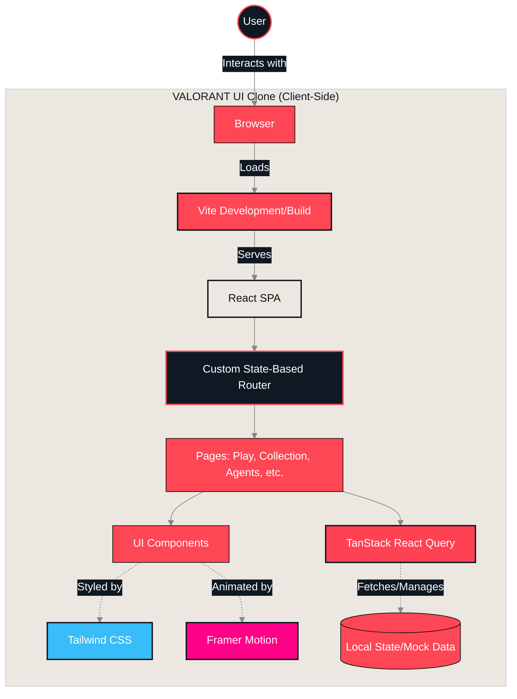
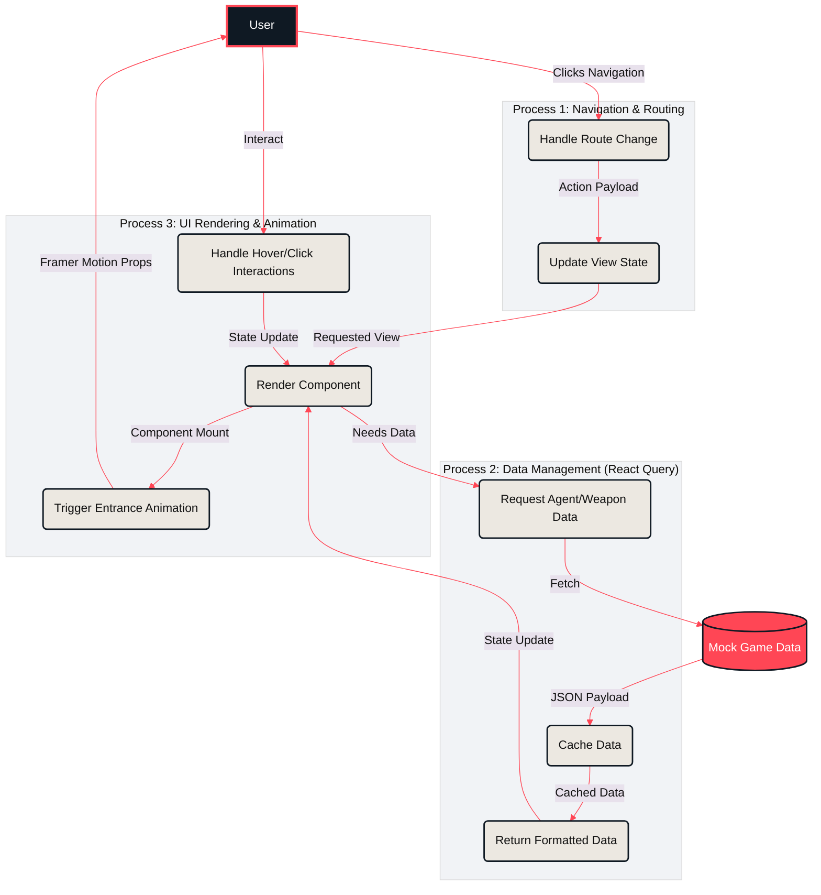
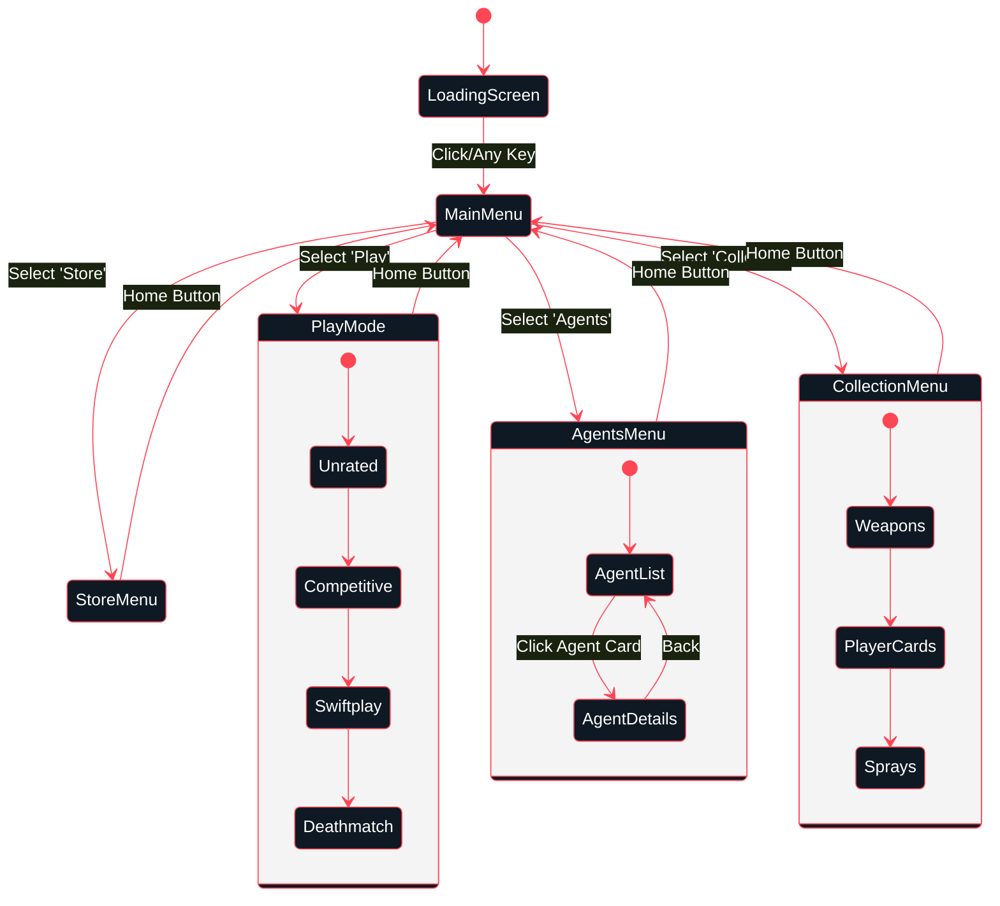
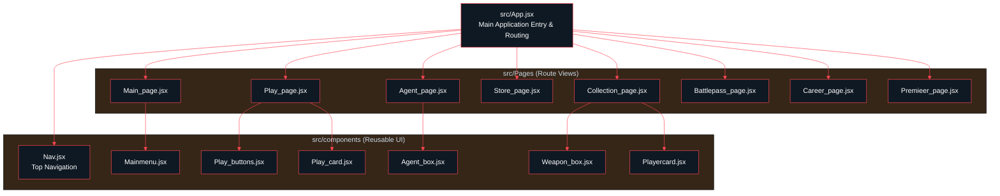

# VALORANT UI Clone

A web-based UI replica of the popular tactical shooter game **VALORANT**, built using React, Vite, and Tailwind CSS. This project aims to recreate the in-game menus and user interface with high fidelity, offering a fully responsive and interactive web experience.

**Live Demo:** [https://valorant-omega.vercel.app/](https://valorant-omega.vercel.app/)

*Note: Click on the screen loading image to enter the application.*

## 🌟 Features

- **High-Fidelity UI/UX:** Accurately mimics the look and feel of the original game's interface.
- **Interactive Pages:** Navigate through various sections just like in the game:
  - **Play:** Matchmaking and custom game lobbies.
  - **Premier:** Competitive tournament system interface.
  - **Collection:** View and manage weapon skins, player cards, and sprays.
  - **Agents:** Browse through all agents and their abilities.
  - **Career:** Match history and player stats layout.
  - **Store:** In-game shop interface.
  - **Battlepass:** Progression tracking layout.
- **Smooth Animations:** Powered by `framer-motion` for seamless transitions and interactions.
- **Data Management:** Utilizing `@tanstack/react-query` for efficient data fetching and state management.
- **Progressive Web App (PWA):** Installable web app capabilities using `vite-plugin-pwa`.

## 🛠️ Technologies Used

- **Core:** [React 18](https://reactjs.org/), [Vite](https://vitejs.dev/)
- **Styling:** [Tailwind CSS](https://tailwindcss.com/)
- **Routing:** Custom state-based dynamic rendering (Single Page Application)
- **State Management & Fetching:** [TanStack React Query](https://tanstack.com/query/v5)
- **Animations:** [Framer Motion](https://www.framer.com/motion/)
- **Icons:** [Lucide React](https://lucide.dev/)

## 🚀 Getting Started

To get a local copy up and running, follow these simple steps.

### Prerequisites

- [Node.js](https://nodejs.org/) (v16 or higher recommended)
- npm or yarn

### Installation

1. **Clone the repository:**
   ```bash
   git clone <repository-url>
   ```

2. **Navigate to the project directory:**
   ```bash
   cd VALORANT
   ```

3. **Install dependencies:**
   ```bash
   npm install
   ```

### Running Locally

To start the development server, run:

```bash
npm run dev
```

Open [http://localhost:5173](http://localhost:5173) in your browser to view the application.

### Building for Production

To create an optimized production build, run:

```bash
npm run build
```

You can preview the production build locally using:

```bash
npm run preview
```

## 🏗️ Architecture & Data Flow

### Architectural Diagram
This diagram illustrates the high-level architecture of the application, showcasing how different libraries and components interact.



### Level 3 Data Flow Diagram (DFD)
This detailed diagram breaks down the processes involved in routing, data fetching (via React Query), and UI rendering within the application.



### UI Flow Diagram
This state diagram represents the user journey and navigation paths available within the UI clone.



### Component File Structure
This tree diagram visualizes the project's file structure and how the main components and pages are linked together.



## 📄 License

This project is open-source and available under the terms of the included [LICENSE](./LICENSE) file.
